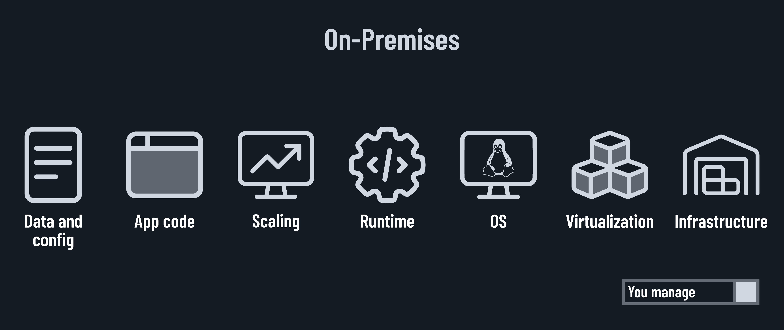
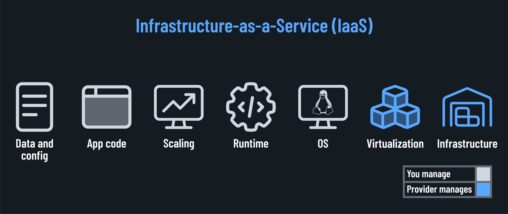
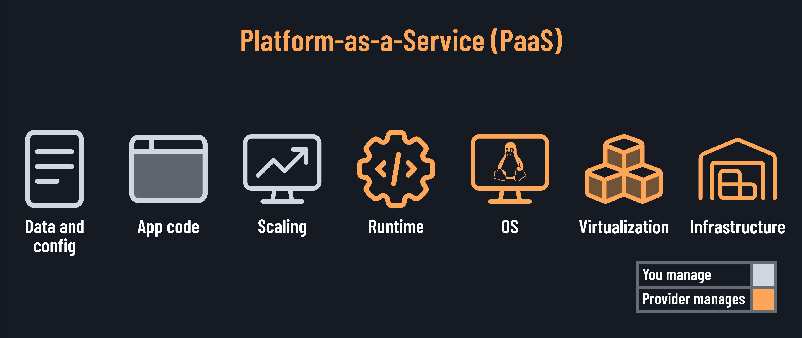
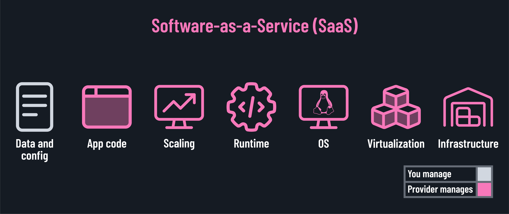

<h1>
  Cloud Concepts and Providers Lab
  Understanding Cloud Service Models
</h1>

**Learning objective:** By the end of this lesson, students will be able to define and differentiate between IaaS, PaaS, and SaaS and identify which model is best suited for various business scenarios.

## On-premises (on-prem)

Before we move to the service models used in the cloud, let's first understand the traditional on-premises model.

In an on-prem model, your organization owns and manages every aspect of the infrastructure, from hardware to software. You have complete control but also bear all the responsibilities.

## Service models

When we discuss cloud computing, we often refer to three main service models: IaaS, PaaS, and SaaS. Each model represents a different level of abstraction and management responsibility.

It's essential to grasp the different levels of service that exist in the cloud computing landscape before we get into the details of specific services or platforms. The three main service models are:

### Infrastructure-as-a-Service (IaaS)

The provider manages the underlying physical infrastructure (servers, storage, networking, virtualization), while you have control over operating systems, storage, deployed applications, and possibly limited control of select networking components. It's like renting the hardware and having the keys to the server room.

### Platform-as-a-Service (PaaS)

In addition to infrastructure, the provider manages operating systems, middleware, and runtime environments. You focus on deploying and managing your applications. It's like renting a fully equipped development studio.

### Software-as-a-Service (SaaS)

The provider manages the entire stack, including applications. You just use the software, typically through a web browser, while the provider handles maintenance, upgrades, security, etc. It's like renting the specific tools you need to get your job done.

## Exercise

Complete this exercise in your Google Doc.

First, which of the above models is Google Docs? Why do you think that?

For each of the following scenarios, identify which service model (IaaS, PaaS, or SaaS) is the best fit and explain why.

- A startup building a new web application from scratch.
- An enterprise migrating legacy systems to the cloud.
- A sales team that needs a CRM solution.
